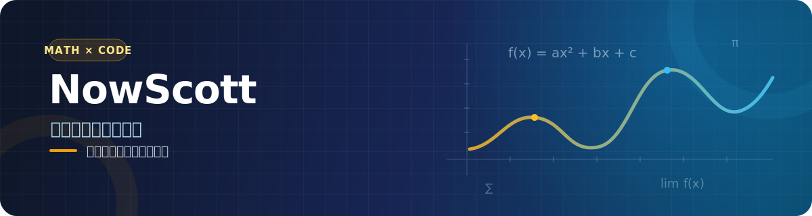

  

   
  
  
  
  
  

## 关于我

你好，我是 **NowScott**，目前是一名新东方高中数学教师。

我的主业是教学：研究题目、打磨课堂，也陪学生把抽象的数学概念一步步想明白。编程则是工作之外的长期爱好，我喜欢用它解决真实的小问题，把重复的事情自动化，也把偶尔冒出的想法做成能用的工具。

- 🧑‍🏫 **职业主线：** 高中数学教学、解题思维与知识表达
- 📐 **持续关注：** 如何把复杂问题讲得准确、清楚、易于理解
- 💻 **业余兴趣：** Web 应用、自动化工具、AI 与开源项目
- 🧰 **做东西的原则：** 从实际需求出发，简单、可靠、能长期使用
- 📍 **所在城市：** 广州

> 教数学，让抽象变得清晰；写代码，让重复变得简单。

## 教学 × 编程

| 📚 课堂内 | 🛠️ 课堂外 |
| --- | --- |
| 高中数学与解题思维 | 用代码改善日常工作流 |
| 教学设计与知识梳理 | 制作小而实用的 Web 工具 |
| 把复杂概念讲清楚 | 探索 AI、自动化与开源 |

我不以职业开发者自居。这里记录的是一位数学老师对技术的好奇，以及把问题真正解决掉的过程。

## 我做过的一些项目

| 项目 | 简介 |
| --- | --- |
| [**Math Card Studio**](https://github.com/nowscott/MathCardStudio) | 面向初高中数学的知识卡片制作工具，让公式与知识点更适合整理和分享。 |
| [**Everyday Tech News**](https://github.com/nowscott/EverydayTechNews) | 自动采集、整理并通过邮件发送每日科技新闻的开源项目。 |
| [**IndWebIndex**](https://github.com/nowscott/IndWebIndex) | 基于 Next.js、Notion API 与 Tailwind CSS 构建的个人索引网站。 |
| [**Check-in Quality Tool**](https://github.com/nowscott/CheckinQualityTool) | 在浏览器本地处理 Excel 的质检工具，关注隐私与实用性。 |

<strong>展开看看我的业余编程足迹</strong>

 

  
  

### 常用工具

  
  
  
  
  
  
  
  

## 保持联系

欢迎交流数学教育、效率工具或有趣的技术想法。

- 🌐 [个人网站](https://nowscott.top/)
- ✍️ [少数派](https://sspai.com/u/nowscott/updates)
- 📺 [Bilibili](https://space.bilibili.com/435359696)
- ✉️ [nowscott@qq.com](mailto:nowscott@qq.com)

  白天讲函数，晚上写函数。

